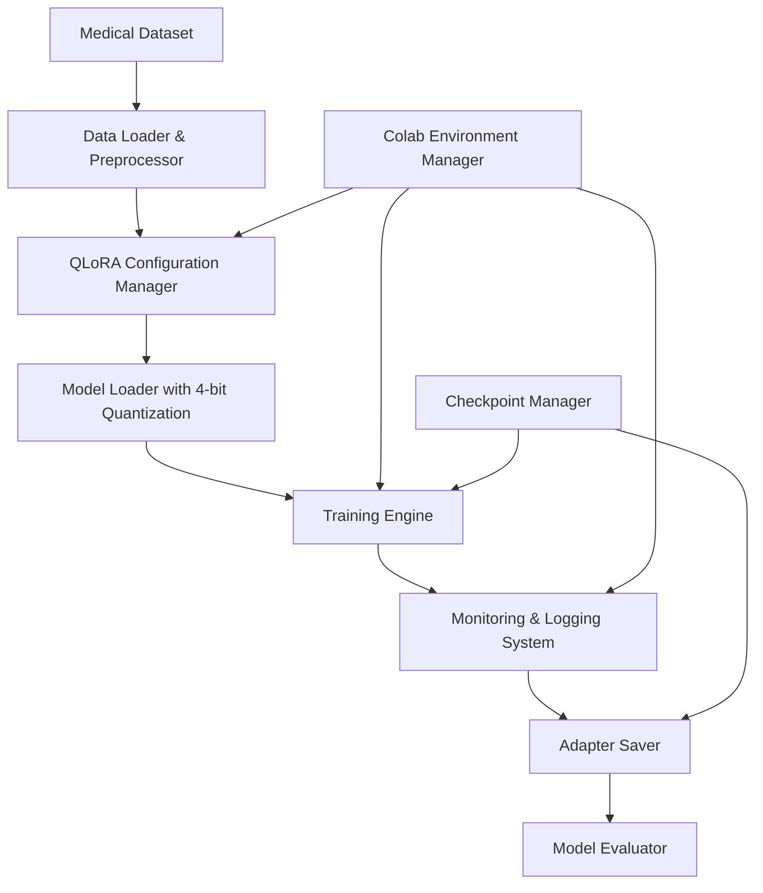

# Design Document: Medical Fine-tuning QLoRA

## Overview

This system implements a QLoRA (Quantized Low-Rank Adaptation) fine-tuning workflow specifically designed for medical language models using Unsloth's optimized framework within Google Colab. The design prioritizes memory efficiency, ease of use, and robust monitoring to enable researchers with limited computational resources to fine-tune large language models on medical datasets.

The architecture leverages 4-bit quantization and low-rank adaptation techniques to reduce memory footprint while maintaining model performance, making it feasible to fine-tune models like Llama 3 or DeepSeek-R1 within Colab's resource constraints.

## Architecture

### High-Level Architecture



### Core Design Principles

1. **Memory Efficiency**: Utilize 4-bit quantization and gradient checkpointing to minimize memory usage
2. **Modularity**: Separate concerns into distinct components for maintainability
3. **Colab Optimization**: Design specifically for Colab's environment and limitations
4. **Error Resilience**: Implement robust error handling and recovery mechanisms
5. **Monitoring First**: Comprehensive logging and monitoring throughout the workflow

## Components and Interfaces

### 1. Data Management Component

**Purpose**: Handle loading, validation, and preprocessing of medical datasets

**Key Classes**:
- `MedicalDatasetLoader`: Loads various medical dataset formats
- `DataValidator`: Validates data structure and filters corrupted entries
- `MedicalTokenizer`: Handles tokenization with medical domain considerations

**Interface**:
```python
class MedicalDatasetLoader:
    def load_dataset(self, dataset_path: str) -> Dataset
    def validate_format(self, dataset: Dataset) -> ValidationResult
    def preprocess_medical_text(self, dataset: Dataset) -> Dataset
    def filter_invalid_entries(self, dataset: Dataset) -> Tuple[Dataset, int]
```

**Design Rationale**: Separating data handling allows for easy extension to different medical dataset formats and ensures data quality before training.

### 2. QLoRA Configuration Manager

**Purpose**: Configure quantization and low-rank adaptation parameters

**Key Classes**:
- `QLoRAConfig`: Configuration container for QLoRA parameters
- `QuantizationManager`: Handles 4-bit quantization setup
- `LoRAParameterOptimizer`: Optimizes rank and alpha parameters based on model size

**Interface**:
```python
class QLoRAConfig:
    def __init__(self, model_name: str, rank: int = 16, alpha: int = 32)
    def configure_quantization(self) -> BitsAndBytesConfig
    def configure_lora_params(self) -> LoraConfig
    def optimize_for_colab(self) -> None
```

**Design Rationale**: Centralized configuration management ensures consistent parameter application and allows for model-specific optimizations.

### 3. Model Management Component

**Purpose**: Handle model loading, quantization, and adapter integration

**Key Classes**:
- `QuantizedModelLoader`: Loads models with 4-bit quantization
- `AdapterManager`: Manages LoRA adapter lifecycle
- `ModelCompatibilityChecker`: Ensures model-adapter compatibility

**Interface**:
```python
class QuantizedModelLoader:
    def load_base_model(self, model_name: str, config: QLoRAConfig) -> AutoModelForCausalLM
    def apply_lora_adapters(self, model: AutoModelForCausalLM) -> PeftModel
    def verify_memory_usage(self) -> MemoryStats
```

**Design Rationale**: Abstraction of model loading complexities while providing memory monitoring capabilities essential for Colab environments.

### 4. Training Engine

**Purpose**: Execute the fine-tuning process with comprehensive monitoring

**Key Classes**:
- `QLoRATrainer`: Main training orchestrator
- `MemoryMonitor`: Real-time memory usage tracking
- `TrainingMetricsLogger`: Logs training progress and metrics

**Interface**:
```python
class QLoRATrainer:
    def __init__(self, model: PeftModel, tokenizer: AutoTokenizer, config: TrainingArguments)
    def train(self, dataset: Dataset) -> TrainingResult
    def monitor_resources(self) -> ResourceStats
    def handle_training_errors(self, error: Exception) -> RecoveryAction
```

**Design Rationale**: Centralized training logic with built-in monitoring addresses the critical need for resource awareness in constrained environments.

### 5. Colab Environment Manager

**Purpose**: Handle Colab-specific optimizations and constraints

**Key Classes**:
- `ColabResourceDetector`: Detects available GPU and memory resources
- `SessionManager`: Manages Colab session limits and disconnections
- `DependencyInstaller`: Handles automatic installation of required packages

**Interface**:
```python
class ColabResourceDetector:
    def detect_gpu(self) -> GPUInfo
    def estimate_memory_capacity(self) -> int
    def configure_environment(self) -> EnvironmentConfig
```

**Design Rationale**: Colab-specific handling ensures optimal resource utilization and provides user guidance for session management.

### 6. Checkpoint and Persistence Manager

**Purpose**: Handle model saving, loading, and checkpoint management

**Key Classes**:
- `AdapterSaver`: Saves fine-tuned adapters with metadata
- `CheckpointManager`: Manages training checkpoints for recovery
- `CloudStorageInterface`: Optional cloud storage integration

**Interface**:
```python
class AdapterSaver:
    def save_adapter(self, model: PeftModel, metadata: TrainingMetadata) -> SaveResult
    def load_adapter(self, adapter_path: str) -> PeftModel
    def verify_compatibility(self, adapter_path: str, base_model: str) -> bool
```

**Design Rationale**: Robust persistence layer ensures training progress is not lost and enables model reuse across sessions.

### 7. Model Evaluation Component

**Purpose**: Test and evaluate fine-tuned models

**Key Classes**:
- `MedicalQueryEvaluator`: Handles medical query testing
- `ResponseComparator`: Compares base vs fine-tuned model responses
- `SafetyFilter`: Filters inappropriate or unsafe content

**Interface**:
```python
class MedicalQueryEvaluator:
    def evaluate_query(self, query: str, model: PeftModel) -> EvaluationResult
    def compare_responses(self, query: str, base_response: str, finetuned_response: str) -> ComparisonResult
    def filter_unsafe_content(self, response: str) -> FilterResult
```

**Design Rationale**: Comprehensive evaluation capabilities ensure model quality and safety, critical for medical applications.

## Data Models

### Core Data Structures

```python
@dataclass
class MedicalDataEntry:
    question: str
    answer: str
    context: Optional[str] = None
    metadata: Dict[str, Any] = field(default_factory=dict)

@dataclass
class TrainingMetadata:
    model_name: str
    dataset_info: Dict[str, Any]
    training_config: Dict[str, Any]
    training_metrics: Dict[str, float]
    timestamp: datetime

@dataclass
class ResourceStats:
    gpu_memory_used: float
    gpu_memory_total: float
    cpu_memory_used: float
    training_time_elapsed: float
    estimated_time_remaining: Optional[float] = None
```

**Design Rationale**: Structured data models ensure consistency across components and facilitate metadata tracking for reproducibility.

## Error Handling

### Error Categories and Strategies

1. **Memory Errors**: 
   - Automatic gradient accumulation adjustment
   - Batch size reduction recommendations
   - Checkpoint saving before memory exhaustion

2. **Data Errors**:
   - Graceful handling of corrupted entries
   - Detailed validation error reporting
   - Automatic data cleaning suggestions

3. **Model Loading Errors**:
   - Compatibility checking before loading
   - Alternative model suggestions
   - Clear error messages with resolution steps

4. **Colab Session Errors**:
   - Automatic checkpoint creation
   - Session reconnection guidance
   - Progress recovery mechanisms

### Error Recovery Mechanisms

```python
class ErrorRecoveryManager:
    def handle_memory_error(self, error: OutOfMemoryError) -> RecoveryAction
    def handle_session_disconnect(self) -> ReconnectionGuide
    def suggest_parameter_adjustments(self, error: TrainingError) -> List[ParameterAdjustment]
```

**Design Rationale**: Proactive error handling reduces user frustration and enables successful completion of training workflows despite common issues.

## Testing Strategy

### Unit Testing
- Component-level testing for each major class
- Mock testing for external dependencies (Hugging Face models, datasets)
- Memory usage testing with simulated constraints

### Integration Testing
- End-to-end workflow testing with sample medical datasets
- Colab environment simulation testing
- Error scenario testing (memory limits, disconnections)

### Performance Testing
- Memory usage profiling under various configurations
- Training speed benchmarking
- Resource utilization optimization validation

### Safety Testing
- Medical content appropriateness validation
- Model output safety filtering
- Data privacy and security compliance

**Design Rationale**: Comprehensive testing ensures reliability in production use and validates the system's ability to handle real-world constraints and edge cases.

## Implementation Considerations

### Memory Optimization Strategies
1. **Gradient Checkpointing**: Trade computation for memory
2. **Dynamic Batch Sizing**: Adjust batch size based on available memory
3. **Efficient Data Loading**: Stream data to minimize memory footprint
4. **Quantization Optimization**: Use optimal quantization parameters for each model

### Colab-Specific Optimizations
1. **Automatic Dependency Management**: Install required packages without user intervention
2. **Session Persistence**: Regular checkpoint saving to handle disconnections
3. **Resource Monitoring**: Continuous monitoring with user alerts
4. **Progress Visualization**: Clear progress indicators suitable for notebook environments

### Extensibility Considerations
1. **Model Support**: Easy addition of new base models
2. **Dataset Formats**: Pluggable dataset loaders for different formats
3. **Storage Backends**: Support for various storage options (local, Google Drive, cloud)
4. **Evaluation Metrics**: Extensible evaluation framework for different medical domains